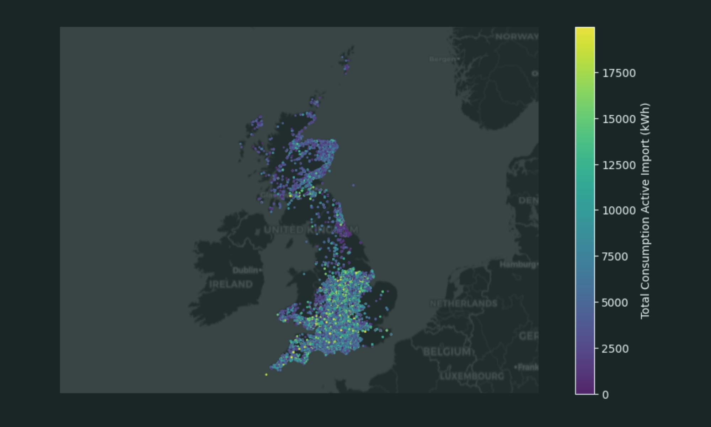

# Weave
We unlock energy data: https://weave.energy

This repository holds the data pipeline and technical documentation for Weave, a project
by [the Centre for AI and Climate](https://www.c-ai-c.org/) and
[CEIMIA](https://ceimia.org). Our mission is to accelerate the application of artificial
intelligence and machine learning to climate problems. To do this, we're trying to
improve access to valuable energy datasets, starting with granular smart meter data from
UK electricity distribution network operators (DNOs). This dataset is valuable because
it's the largest and most granular dataset of real domestic energy consumption anywhere
in the world. We think it can help understand and potentially predict electricity demand
in novel ways.

We have previously released
[prototype code](https://github.com/centre-for-ai-and-climate/lv-feeder-smart-meter-data)
for working with this data, but this repo represents our attempt to make that into a
more "production-ready" data pipeline. Importantly, this is also an open-source project
and we welcome external contributions.

## How do I get the data?
You do not need to run this code to get the data, this repository is the data pipeline
that builds GeoParquet files and uploads them to our Amazon S3 bucket. Data is freely
available from there, see https://weave.energy or
[the examples in our docs](docs/smart-meter-examples.ipynb) for more details.

## Contributing
If you'd like to contribute to weave, see our [documentation](CONTRIBUTING.md) or [our
issues list](https://github.com/centre-for-ai-and-climate/weave/contribute) for something
to get stuck into.